# Contenedores

### Crear un contenedor
Para crear un nuevo contenedor Docker a partir de una imagen específica, pero sin iniciarlo automáticamente. 

```
docker create --name <nombre contenedor> <nombre imagen>:<tag>
```
Crear el contenedor  **srv-web** usando la imagen nginx version alpine

```
docker create --name srv-web nginx:alpine
```
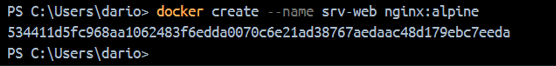


# COMPLETAR

Si creas un contenedor en Docker sin asignarle un nombre específico utilizando la opción --name, Docker asignará automáticamente un nombre aleatorio al contenedor. Este nombre suele consistir en una combinación de palabras y números.  

Crear el contenedor usando la imagen hello-world

```
docker create hello-world
```

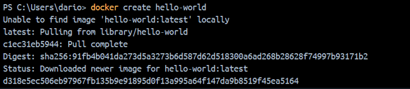


### Listar los contenedores ejecutándose o no

```
docker ps -a
```

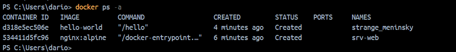

### Para iniciar un contenedor

```
docker start <nombre contenedor o identificador>
```
Iniciar el contenedor srv-web 

```
docker start srv-web
```

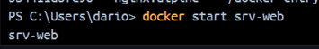


### Listar los contenedores ejecutándose
Para ver solo los contenedores que están corriendo en este momento:
```
docker ps 
```

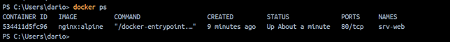

Para buscar un contenedor específico dentro de los que están en ejecución: 

```
docker ps | grep <nombre contenedor>
```

Por ejemplo srv-web:

```
docker ps | Select-String "srv-web"
```

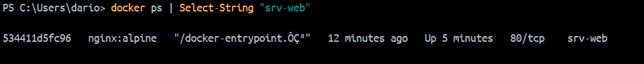

### Para detener un contenedor

```
docker stop <nombre contenedor>
```

Vamos a poner un ejemplo de detener un contenedor, utilizamos srv-web: 

```
docker stop srv-web
```

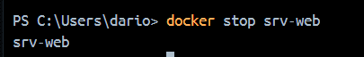


### Para crear un contenedor y ejecutarlo inmediatamente

```
docker run --name <nombre contenedor> <nombre imagen>:<tag>
```


Crear y ejecutar inmediatamente el contenedor **srv-web2** usando la imagen nginx:alpine

```
docker run --name srv-web2 nginx:alpine
```

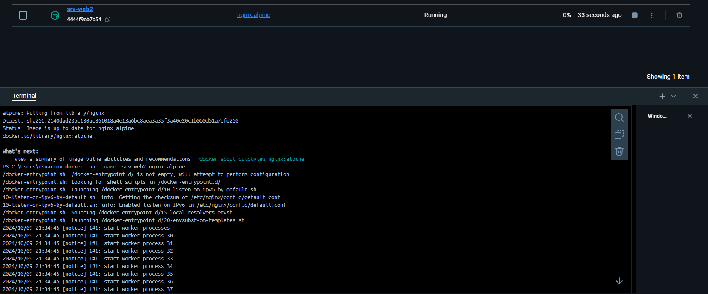


**¿Qué sucede luego de la ejecución del comando?**

Al momento de ejecutar este comando se ejecutara el contenedor en primer plano, por lo que capturará el terminal y no se podra introducir más comandos hasta que se detenga.

Cuando ejecutas un contenedor en primer plano sin la opción -d (modo detach), el contenedor captura la entrada estándar (stdin) del terminal, lo que significa que el terminal queda "atrapado" y no puedes introducir más comandos hasta que detengas el contenedor.

### Para crear un contenedor y ejecutarlo inmediatamente sin estar vinculados al mismo
-d: Es la opción que indica a Docker que ejecute el contenedor en segundo plano (en modo "detach").
Cuando un contenedor se ejecuta en segundo plano, Docker devuelve el control al terminal inmediatamente después de iniciar el contenedor, lo que permite al usuario seguir ejecutando otros comandos en el mismo terminal sin que el contenedor detenga la interacción.

```
docker run -d --name <nombre contenedor> <nombre imagen>:tag
```
Crear y ejecutar inmediatamente el contenedor **srv-web3** en modo detach usando la imagen nginx:alpine

```
docker run -d --name srv-web3 nginx:alpine
```

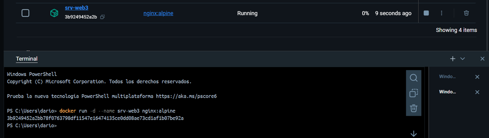

### Para eliminar un contenedor

```
docker rm <nombre contenedor>
```
Eliminar el contenedor que se creó a partir de la imagen hello-world 

```
docker rm strange_meninsky
```

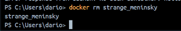

Verificar que el contenedor que se eliminó

Primero podemos verificar en la parte de "Containers", donde no aparece el contenedor "strange_meninsky"

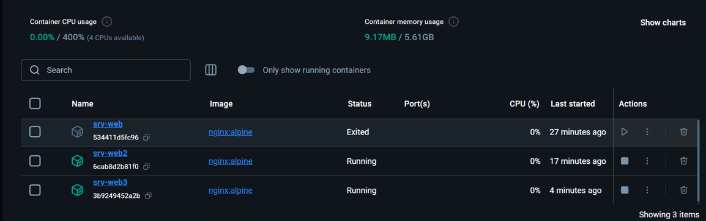

Otra forma es mediante este comando:
```
docker ps -a
```

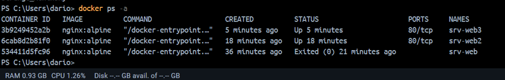


### Para eliminar un contenedor que esté ejecutándose

```
docker rm -f <nombre contenedor>
```
Eliminar el contenedor **srv-web3** 

```
docker rm -f srv-web3
```

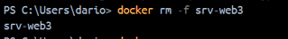

Verificar que el contenedor que se eliminó

```
docker ps -a
```

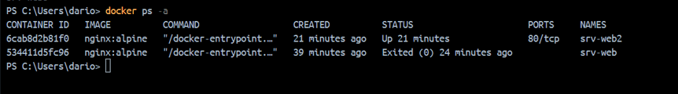


### Para inspecionar un contenedor 

Inspeccionar el contenedor **srv-web** 

```
docker inspect srv-web
```

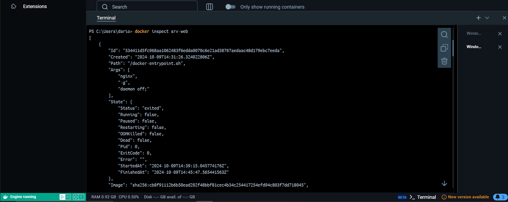

