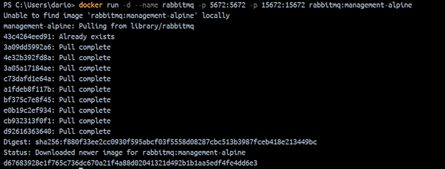

# Mapeo de puertos
El mapeo de puertos es un mecanismo que permite redirigir el tráfico de red desde un puerto en el host (tu máquina local o servidor) hacia un puerto específico en un contenedor Docker.
Por ejemplo, supongamos que tienes un contenedor que ejecuta un servidor web en el puerto 80 dentro del contenedor, pero quieres acceder a ese servidor desde tu navegador en la máquina host. Puedes usar el mapeo de puertos para redirigir el tráfico del puerto 80 del contenedor al puerto 3000 en el host. De esta manera, cuando accedas a http://localhost:3000 en tu navegador, el tráfico se dirigirá al servidor web dentro del contenedor en el puerto 80.


### Para crear un mapeo de puertos (puerto host y puerto contenedor)
El mapeo de puertos se especifica al ejecutar un contenedor Docker utilizando la opción -p o --publish seguida de los puertos que deseas mapear
```
docker run -d --name <nombre contenedor> -p <puerto host>:<puerto contenedor> <nombre imagen>:<tag>

```
Crear un contenedor a partir de la imagen nginx version alpine con el mapeo de puertos del ejemplo gráfico, host 3000 y contenedor 80

* Primero, vamos a crear un contenedor a partir de la imagen nginx:alpine, mapeando el puerto 3000 del host al puerto 80 del contenedor.
* El puerto 80 es el servidor web Nginx que está escuchando dentro del contenedor, y queremos que sea accesible desde el puerto 3000 en la máquina host.

```
docker run -d --name srv-web-nginx -p 3000:80 nginx:alpine

```


Una vez ejecutado, Docker lanzará el contenedor en segundo plano.

VERIFICAR 

```
docker ps

```


ACCESO http://localhost:3000


### Para mapear más de un puerto

```
docker run -d --name <nombre contenedor> -p <puerto host 01>:<puerto contenedor 01> -p <puerto host 02>:<puerto contenedor 02> <nombre imagen>:<tag>
```

Crear un contenedor a partir de la imagen rabbitmq version management-alpine, para este mapeo de puertos usar en el host los mismos puertos del contenedor.

* RabbitMQ en la versión management requiere varios puertos para su funcionamiento, incluidos el puerto del protocolo AMQP (generalmente el 5672) y el puerto del panel de administración web (15672).

```
docker run -d --name rabbitmq -p 5672:5672 -p 15672:15672 rabbitmq:management-alpine
```



VERIFICAR 

```
docker ps

```


ACCESO http://localhost:15672


